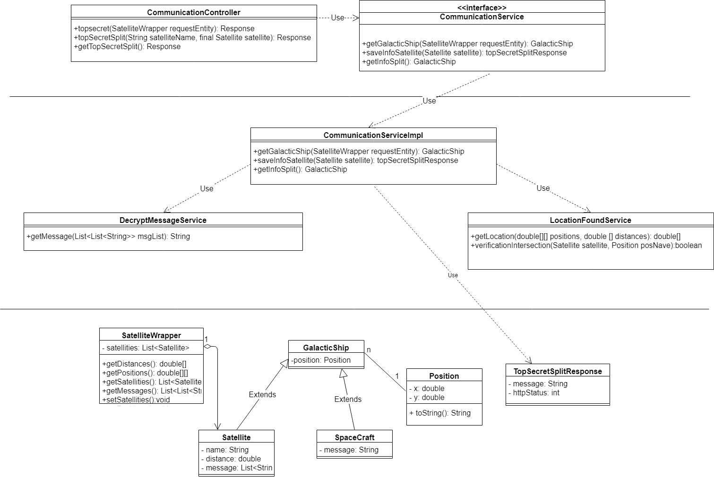
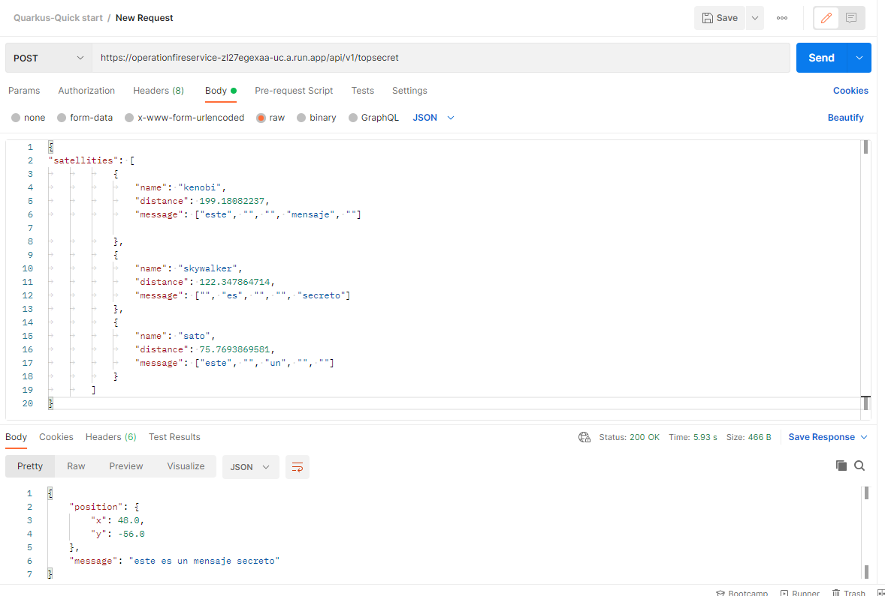
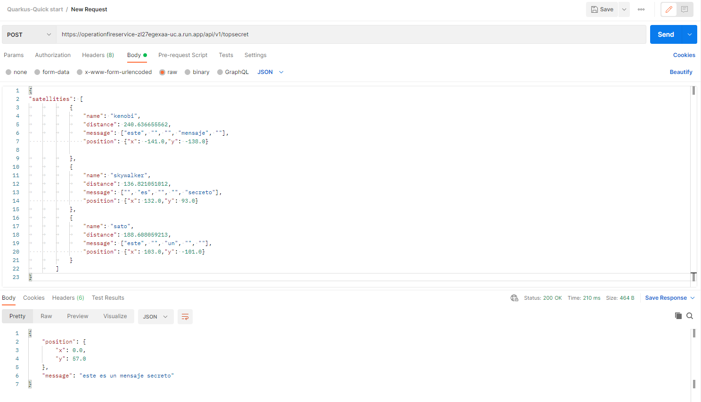
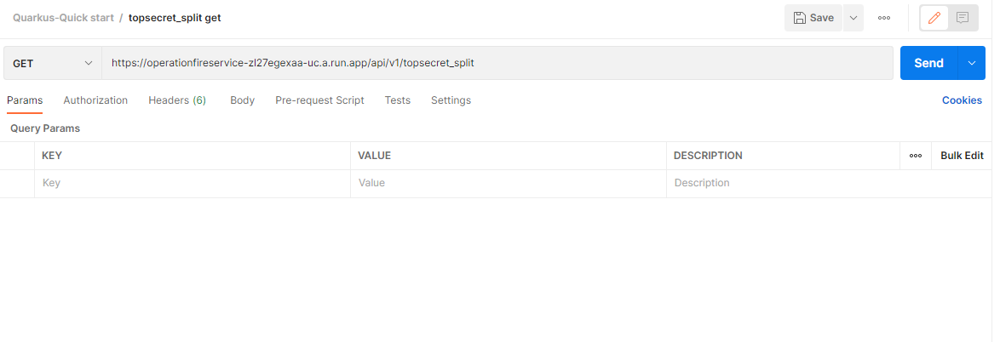

# operationfire Project
# Breve descripcion de Quarkus Framework

This project uses Quarkus, the Supersonic Subatomic Java Framework.

If you want to learn more about Quarkus, please visit its website: https://quarkus.io/ .

## Running the application in dev mode

You can run your application in dev mode that enables live coding using:
```shell script
./mvnw compile quarkus:dev
```

> **_NOTE:_**  Quarkus now ships with a Dev UI, which is available in dev mode only at http://localhost:8080/q/dev/.

## Packaging and running the application


The application can be packaged using:
```shell script
./mvnw package
```
It produces the `quarkus-run.jar` file in the `target/quarkus-app/` directory.
Be aware that it’s not an _über-jar_ as the dependencies are copied into the `target/quarkus-app/lib/` directory.

If you want to build an _über-jar_, execute the following command:
```shell script
./mvnw package -Dquarkus.package.type=uber-jar
```

The application is now runnable using `java -jar target/quarkus-app/quarkus-run.jar`.

## Creating a native executable

You can create a native executable using: 
```shell script
./mvnw package -Pnative
```

Or, if you don't have GraalVM installed, you can run the native executable build in a container using: 
```shell script
./mvnw package -Pnative -Dquarkus.native.container-build=true
```

You can then execute your native executable with: `./target/operationfire-1.0.0-SNAPSHOT-runner`

If you want to learn more about building native executables, please consult https://quarkus.io/guides/maven-tooling.html.

## Provided Code

### RESTEasy JAX-RS

Easily start your RESTful Web Services

[Related guide section...](https://quarkus.io/guides/getting-started#the-jax-rs-resources)

## DOCUMENTACION - FUNCIONAMIENTO DE LA API - INFO PROYECTO

### Stack tecnologico
- Java 11+
- Apache Maven 3.8.1 +
- Quarkus Framework 2.0.2
- IDE Visual Studio Code
- Docker
- Google Cloud Platform

## Arquitectura API

Diagrama de Clases UML



- La ApiREST se compone de 3 capas: Resources(Controladores REST) , Service(Interfaces e implementaciones de servicio) y Model(Entidades).
 
# Endpoints en ambiente local

Una vez clonado el repositorio situarse en la raiz del proyecto y ejecutar:

```shell script
./mvnw compile quarkus:dev
```
Esto levantara quarkus en modo desarrollo en el puerto localhost.

Se accenden a los siguientes endpoints:

### GET /health
- A) http://localhost:8080/api/v1/health
sirve para diagnosticar el estado de la api al levantar el servicio.

### POST /topsecret
- B) http://localhost:8080/api/v1/topsecret implementa el "Trilateration method" para resolver la posicion y el mensaje de la nave, descrifrada por los 3 satelites Kenobi, Skywalker, Sato

### POST /topsecret_split/{name}
- C) http://localhost:8080/api/v1/topsecret_split/{satellite_name} se indica el nombre del satelite en "{satellite_name}" para agregar un satelite en memoria.

### GET /topsecret_split
- D) http://localhost:8080/api/v1/topsecret_split este metodo revisa en memoria los satelites cargados por el metodo topsecret_split/{satellite_name} , y usa la "Trilateration" para calcular la posicion de la nave y descifrar el  mensaje.

# Swagger UI
- Localhost 
```shell script
http://localhost:8080/swagger-ui/
```

- Google Cloud 
```shell script
https://operationfireservice-zl27egexaa-uc.a.run.app/swagger-ui/
```

# Application.Properties y Ejemplo por defecto

En el archivo application.properties se encuentran los puntos cartesianos de los satelites que se usaran por defecto en el caso de que en el cuerpo JSON del POST para B)  no se especifiquen las posiciones de los satelites

```shell script
#Ejemplo 1
satellities.0.position=-120.0,51.0
satellities.1.position=133.0,32.0
satellities.2.position=118.0,-85.0
```
Para probar el ejemplo por default de la API 

### Localhost POST
```shell script
http://localhost:8080/api/v1/topsecret
```
### Google Cloud POST
```shell script
https://operationfireservice-zl27egexaa-uc.a.run.app/api/v1/topsecret
```

Usar el siguiente json:

```json
{
"satellities": [
			{
				"name": "kenobi",
				"distance": 199.18082237,
				"message": ["este", "", "", "mensaje", ""]

			},
			{
				"name": "skywalker",
				"distance": 122.347864714,
				"message": ["", "es", "", "", "secreto"]
			},
			{
				"name": "sato",
				"distance": 75.7693869581,
				"message": ["este", "", "un", "", ""]
			}
		]
}
```



Usando https://www.geogebra.org/graphing?lang=en
podemos comprobar que matematicamente el punto que dio el Response intersecta con los 3 satelites 


img 1.2

# Libreria com.lemmingapex.trilateration
Para hacer la trilateracion un proceso mas escalable se usó la libreria
https://github.com/lemmingapex/trilateration

La resolucion del sistema de ecuaciones de circunferencia de forma manual se puede ver en el metodo ubicado en 
```shell script
/src/main/java/org/meli/service/LocationFoundService.java
Metodo
private double[] trackPosition()
```

este metodo refleja lo que hace la libreria lemmingapex.trilateration por atras, pero de manera menos escalable. Se usa para entender el significado y resolucion matematico que tiene la trilateracion.


Para informacion detallada sobre como actua matematicamente la trillateration se puede consultar este ejemplo:
https://acolita.com/como-funcionan-los-dispositivos-gps-trilateracion-vs-triangulacion/


# Ejemplos Request JSON con posicion

### Ejemplo POST /topsecret : 
Se pueden probar otras distancias y puntos en el metodo POST
```shell script
http://localhost:8080/api/v1/topsecret
```

### Google Cloud POST
```shell script
https://operationfireservice-zl27egexaa-uc.a.run.app/api/v1/topsecret
```

Siempre y cuando se cumpla que:
- Matematicamente los puntos cartesianos deben coincidir con la distancia y asi poder calcular la triangulacion (se puede comprobar en https://www.geogebra.org/graphing?lang=en)
- Todos los satelites deben tener la posicion definida como se muestra a continuacion:

El siguiente JSON es otra posicion de los salites con la distancia requerida:

```json
{
"satellities": [
			{
				"name": "kenobi",
				"distance": 240.636655562,
				"message": ["este", "", "", "mensaje", ""],
                "position": {"x": -141.0,"y": -138.0}

			},
			{
				"name": "skywalker",
				"distance": 136.821051012,
				"message": ["", "es", "", "", "secreto"],
                "position": {"x": 132.0,"y": 93.0}
			},
			{
				"name": "sato",
				"distance": 188.608059213,
				"message": ["este", "", "un", "", ""],
                "position": {"x": 103.0,"y": -101.0}
			}
		]
}
```



**Nota:** los puntos "x" , "y" y las distancias, no son al azar, deben coincidir matematicamente en un sistema de 3 ecuaciones con dos incognitas como se muestra en la imagen (img 1.2).

Se considerará como mejora poner los puntos "x" , "y" de los satelites de forma randomizada.


# Ejemplo nivel 3 topsecret_split

Se pueden agregar satelites por separado con los siguientes pasos:

- Paso 1: 
enviar 3 post de manera *consecutiva* con los nombres kenobi, skywalker y sato , se pueden enviar en cualquier orden. 

Ambiente local POST:
```shell script
http://localhost:8080/api/v1/topsecret_split/kenobi
```
```shell script
http://localhost:8080/api/v1/topsecret_split/skywalker
```
```shell script
http://localhost:8080/api/v1/topsecret_split/sato
```
Google Cloud POST:
```shell script
 https://operationfireservice-zl27egexaa-uc.a.run.app/api/v1/topsecret_split/kenobi
```
```shell script
 https://operationfireservice-zl27egexaa-uc.a.run.app/api/v1/topsecret_split/skywalker
```

```shell script
https://operationfireservice-zl27egexaa-uc.a.run.app/api/v1/topsecret_split/sato
```

Con el siguiente formato para cada uno respectivamente en el body:

- Kenobi
```json
{
	"distance": 199.18082237,
	"message": ["este", "", "", "mensaje", ""]
}
```

- skywalker
```json
{
    "distance": 122.347864714,
    "message": ["", "es", "", "", "secreto"]
}
```

- sato
```json
{
	"distance": 75.7693869581,
	"message": ["este", "", "un", "", ""]
}
```


- Paso 2: 
### Una vez agregados los 3 satelites ejectuar el topsecret_split get:

- localhost GET
```shell script
http://localhost:8080/api/v1/topsecret_split
```

- Google Cloud GET
```shell script
https://operationfireservice-zl27egexaa-uc.a.run.app/api/v1/topsecret_split
```



# Consideraciones y Limitaciones del proyecto

- Los puntos "x" "y" de los satelites no son randomizados, no varian, por lo que si se quiere comprobar la triangulacion en el topsecret POST con otros datos, estos datos deben tener sentido matematicamente, es decir la posicion de los satelites deben intersectar con sus distancias como se explica en la parte de trillateration.

- No se toma en cuenta el caso de uso si el metodo post topsecret_split/satelliteName o post /topsecret recibe mas de 3 satelites.

- El formato en que se puede enviar los mensajes es muy especifico.

- Una vez hecho el GET topsecret_split (nivel 3) , la informacion de los satelites cargados será borrada, se deberan agregar nuevamente.

### El nivel 3 unicamente funciona con los satelites en las posiciones del application.properties:
 - kenobi: x: 120.0 , y: 51.0
 - skywalker: x: 133.0 y: 32.0
 - sato : x: 118.0, y: -85.0

 esto es debido a que no se está utilizando posiciones randomizadas.


# Plataforma Google Cloud

Para checkear la API en la nube:
```shell script
https://operationfireservice-zl27egexaa-uc.a.run.app/api/v1/health
```
